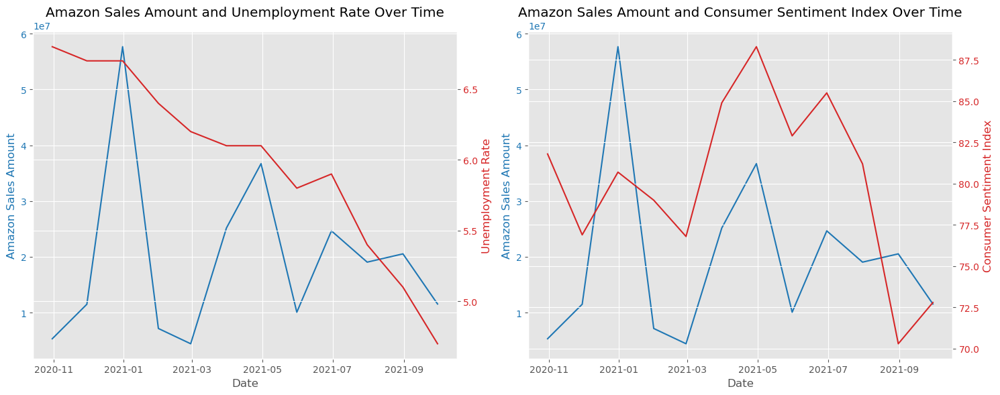

# Amazon Sales Data Analysis


# Group2: Prime Suspects 

Resources:
- Amazon Sales FY2020-21: https://www.kaggle.com/datasets/earthfromtop/amazon-sales-fy202021
Attribution: CC0 1.0 DEED

- Consumer Confidence Index (University of Michigan):
https://data.sca.isr.umich.edu/data-archive/mine.php

- Unemployment Index:
 https://www.bls.gov/charts/employment-situation/civilian-unemployment-rate.htm

## Table of Contents

1. [Introduction](#introduction)
2. [Prerequisites](#prerequisites)
3. [Getting Started](#getting-started)
4. [Project Structure](#project-structure)
5. [Beauty & Grooming Analysis](#beauty&grooming-analysis)
6. [Demographics](#demographics)
7. [Sales Trend Over Time](#sales-trend-over-time)
9. [Average Order Value Over Time](#average-order-value-over-time)
10. [Discount vs. Total Sales](#discount-vs-total-sales)
11. [Sales trend by region & category](#sales-category-by-region-&-category)
12. [Price Trend](#price-trend)
13. [Total Sales vs Customer sentiment Index](#total-sales-vs-customer-sentiment-indexs)
14. [Limitations of Data](#limitations-of-data)
15. [Additional Learnings](#additional-learnings)
16. [Declaration](#declaration)
17. [Group contributors](#group-contributors)


## Introduction/Motivation

This project aims to analyze Amazon sales data for the fiscal year October 2020-September 21. The analysis includes data cleaning, exploratory data analysis, and visualizations to gain insights into sales trends, performance, and customer behavior.
Based on the search results provided, there are several key motivations for analyzing sales data:

1. Identify trends and opportunities for growth [1][2][3]
By analyzing sales data, companies can spot emerging market trends, top-performing products/services, and areas for potential revenue growth. This allows them to strategically allocate resources and tailor their sales strategies to capitalize on these opportunities.

2. Improve sales team performance [1][3][4]
Sales data analysis provides insights into individual and team performance, allowing sales leaders to identify areas for improvement, provide targeted coaching/training, and set realistic and motivating goals for their sales reps. This can lead to increased productivity and better achievement of sales quotas.

3. Optimize sales processes and forecasting [2][3][5]
By analyzing data on sales cycles, conversion rates, and historical performance, companies can identify bottlenecks and inefficiencies in their sales processes. This enables them to streamline processes, improve forecasting accuracy, and set more realistic revenue targets.

4. Enhance customer satisfaction and retention [2][3]
Sales data can reveal insights into customer behavior, preferences, and satisfaction levels. This information can be used to improve product offerings, customer service, and overall customer experience, leading to higher retention rates and long-term revenue growth.

5. Motivate and retain top sales talent [1][4]
Sales data analysis can help identify factors contributing to sales rep attrition and dissatisfaction. By addressing these issues proactively through incentives, support, or adjustments to sales plans, companies can improve motivation and retention of their top-performing sales professionals.

6. Enable data-driven decision-making [1][3][5]
By automating data integration and analysis, companies can make more informed, confident, and timely decisions based on real-time data insights, rather than relying on gut instincts or outdated information.

In summary, the primary motivation for analyzing sales data is to gain a comprehensive understanding of sales performance, market dynamics, and customer behavior, which can then be leveraged to drive revenue growth, improve operational efficiency, and foster a motivated and high-performing sales team. Ultimately, effective sales data analysis empowers companies to make strategic, data-driven decisions that enhance their competitiveness and profitability.

Citations:
[1] https://www.varicent.com/blog/sales-data-analysis
[2] https://www.bluwave.net/analyze-sales-data/
[3] https://demodesk.com/blog/sales-leadership-analyze-sales-data
[4] https://www.linkedin.com/pulse/how-motivate-your-sales-team-during-end-of-quarter-mid-year
[5] https://www.pipedrive.com/en/blog/sales-data

## Prerequisites

- Python 3.x
- Jupyter Notebook or Visual Studio Code with Python extension
- Required Python libraries: pandas, numpy, matplotlib, seaborn, plotly

## Getting Started

1. Clone the repository or download the project files.
2. Open the project in Visual Studio Code or Jupyter Notebook.
3. Install the required Python libraries by running `pip install -r requirements.txt` in your terminal or command prompt.
4. Place the `Amazon Sales FY2020-21.csv` file in the `Resources` directory.

## Data Exploration

### Data Loading and Inspection

This section loads the Amazon sales data from a CSV file and performs basic data inspection tasks, such as displaying the first few rows, column names, data types, and summary statistics.

```python
# Reading a CSV file named 'Amazon Sales FY2020-21.csv' located in the 'Resources' directory
# and storing the data in a DataFrame named 'main_df'.
main_df = pd.read_csv('Resources/Amazon Sales FY2020-21.csv')

# Displaying the first few rows of the DataFrame 'main_df'.
main_df.head()

# View the column names in the data

main_df.columns
# Use the describe function to gather some basic statistics

main_df.describe()

# Getting the dimensions (number of rows and columns) of the DataFrame 'main_df'.
main_df.shape
```

### Top Categories

This section identifies the top three categories with the most entries by counting the occurrences of each category.

```python
# What three item categories had the most entries?
categories = main_df["category"].value_counts()
categories.head(20)
```

### Category-wise DataFrames

This section creates separate DataFrames for specific categories like "Mobiles & Tablets," "Men's Fashion," "Appliances," "Women's Fashion," and "Beauty & Grooming." This allows for category-specific analysis and visualization.

```python
# Creating a new DataFrame 'mobiles_tablets_df' containing only the rows from the original DataFrame 'main_df'
# where the value in the "category" column is equal to "Mobiles & Tablets".
mobiles_tablets_df = main_df[main_df["category"] == "Mobiles & Tablets"]

# Displaying the first few rows of the DataFrame 'mobiles_tablets_df' which contains data related to "Mobiles & Tablets".
mobiles_tablets_df.head()

# Creating a new DataFrame 'mens_fashion_df' containing only the rows from the original DataFrame 'main_df'
# where the value in the "category" column is equal to "Men's Fashion".
mens_fashion_df = main_df[main_df["category"] == "Men's Fashion"]

# Creating a new DataFrame 'appliances_df' containing only the rows from the original DataFrame 'main_df'
# where the value in the "category" column is equal to "Appliances".
appliances_df = main_df[main_df["category"] == "Appliances"]

# Creating a new DataFrame 'womens_fashion_df' containing only the rows from the original DataFrame 'main_df'
# where the value in the "category" column is equal to "Women's Fashion".
womens_fashion_df = main_df[main_df["category"] == "Women's Fashion"]

# Reading the CSV file and storing data in a DataFrame (CC section)
main_df = pd.read_csv('Resources/Amazon Sales FY2020-21.csv')

beauty_grooming_df = main_df[main_df["category"] == "Beauty & Grooming"]
```

### Beauty & Grooming Analysis - main visualization


**Analysis:**

In this output visual:
Bars: Each bar represents the total sales for a specific age bin within a quarter. 
The height of the bars varies, indicating different total sales values for different age bin and quarter combinations.

X-axis: The x-axis displays the age bin ranges, such as '(0.0, 10.0)', '(10.0, 20.0)', '(20.0, 30.0)', and so on. 
These labels represent the age ranges in years.

Y-axis: The y-axis represents the total sales value. 
The higher the bar, the higher the total sales for that particular age bin and quarter combination.

Colors: There are four distinct colors in the bars, representing the four different quarters present in the data.

Legend: The legend in the top-left corner shows the mapping between the colors and the corresponding quarters. 
For example, the light blue color represents 'Q1', green represents 'Q2', orange represents 'Q3', and purple represents 'Q4'.

By analyzing this visual, you can make the following observations:
The age bin '(30.0, 40.0)' (likely representing ages between 30 and 40 years) has the highest total sales 
across all quarters, as indicated by the tallest bars in all colors.
The age bin '(0.0, 10.0)' (likely representing ages between 0 and 10 years) has the lowest total sales across
 all quarters, as indicated by the shortest bars in all colors.
For most age bins, the total sales seem to be highest in 'Q3' (orange bars) and lowest in 'Q1' (light blue bars), 
suggesting potential seasonal variations in sales.
There are some age bins where the total sales are relatively consistent across quarters, such as '(20.0, 30.0)' and '(40.0, 50.0)'.
Overall, this visual allows you to compare the total sales across different age groups (age bins) 
and identify which age groups contribute the most or least to the total sales in each quarter. 
It also helps you spot any potential trends or patterns in sales across different quarters for specific age groups.'''

```python
# Create a figure and axis
fig, ax = plt.subplots(figsize=(10, 6))

# Pivot the data to create a wide format suitable for dot plot
dot_plot_data = sales_by_quarter_age_bin.pivot(index='age_bin', columns='quarter', values='value')

# Plot the dot plot
dot_plot_data.plot(kind='bar', ax=ax, edgecolor='black', linewidth=1)

# Set chart title and axis labels
ax.set_title('Quarterly Total Sales by Age Bin')
ax.set_xlabel('Age Bins')
ax.set_ylabel('Total Sales')

# Rotate x-axis labels for better visibility
plt.xticks(rotation=45)

# Add legend
ax.legend(dot_plot_data.columns, title='Quarter', bbox_to_anchor=(1.02, 1), loc='upper left')

# Display the chart
plt.tight_layout()
plt.show()
```

## Demographics


This section analyzes the distribution of categories by age and gender visualizes it using a bar plot.

```python
count_df = main_df.groupby(['category', 'Gender']).size().unstack(fill_value=0)
count_df.plot(kind='bar', alpha=0.7, figsize=(12, 6))

plt.title('Distribution of Categories by Gender')

plt.xlabel('Categories')

plt.ylabel('Frequency')

plt.show()

# ax = count_df[['Gender', 'category']].plot.hist(bins=30, alpha=0.7, figsize=(12, 6))

# Adding titles and labels
# ax.set_title('Histogram of Two Variables')
# ax.set_xlabel('Value')
# ax.set_ylabel('Frequency')

# Display the plot
plt.show()
```

**Analysis:**
The bar plot visualizes the distribution of categories by gender. Each bar represents the frequency or count of entries for a particular category, divided into segments representing different genders (e.g., male and female).

Key Observations:
- The x-axis represents the different product categories.
- The y-axis represents the frequency or count of entries.
- Each bar is divided into segments, with each segment representing a specific gender.
- The height of each segment within a bar indicates the number of entries for that category within the corresponding gender.

By analyzing the bar plot, you can gain insights into the following:

1. **Gender Preferences**: Within each bar, you can observe the relative heights of the segments to understand which gender is more inclined towards a particular category. Taller segments indicate a higher frequency of entries for that gender within the category.

2. **Category Trends by Gender**: By comparing the segment heights across categories, you can identify patterns or trends in category preferences among different genders. For example, if a particular category consistently has a taller segment for a specific gender across multiple categories, it may suggest a strong preference for that category among that gender.

## Sales Trend Over Time


This section analyzes and plots the sales trend over time by aggregating the total sales value by week.

```python
# Time Series Analysis for Weekly Sales
plt.figure(figsize=(12, 6))
weekly_sales.plot()
plt.title('Weekly Sales Over Time')
plt.xlabel('Week')
plt.ylabel('Total Sales (ten millions)')
plt.grid(True)
plt.tight_layout()

plt.savefig("Images/3. Total Sales (line).png")
plt.show()
```

**Analysis:**
The line plot visualizes the sales trend over time by displaying the total sales value aggregated by week.

Key Observations:
- The x-axis represents the time dimension, typically months or years.
- The y-axis represents the total sales value.
- Each data point on the line represents the total sales value for a specific time period (e.g., month or year).
- The line connects the data points, allowing you to observe the overall trend and patterns in sales over time.

By analyzing the line plot, you can gain insights into the following:

1. **Seasonal Patterns**: The line plot can reveal seasonal patterns or cyclical trends in sales. For example, if there are recurring peaks or valleys at specific times of the year, it may indicate the influence of seasonal factors such as holidays, weather, or consumer behavior patterns.

2. **Growth or Decline Trends**: The overall shape of the line can indicate whether sales are experiencing growth, decline, or stability over the analyzed time period. An upward-sloping line suggests growth, while a downward-sloping line indicates a decline in sales.

3. **Trend Volatility**: The degree of fluctuation or volatility in the line can provide insights into the stability or variability of sales over time. A relatively smooth line may indicate consistent sales performance, while a line with significant fluctuations could suggest the presence of external factors or market dynamics influencing sales.

4. **Anomalies or Outliers**: Sudden spikes or dips in the line may represent anomalies or outliers that warrant further investigation. These could be caused by exceptional events, promotional campaigns, or other factors that significantly impacted sales during a specific time period.

5. **Forecasting and Planning**: By understanding the sales trend over time, businesses can make informed decisions about inventory management, resource allocation, and strategic planning. The analysis can help identify potential growth opportunities or areas that may require corrective actions.

Overall, the line plot provides a visual representation of the sales trend over time, enabling businesses to identify patterns, detect anomalies, and make data-driven decisions related to sales forecasting, inventory management, and strategic planning.

## Average Order Value Over Time


This section calculates and plots the average order value over time, including annotations for percentage changes with colored arrows.

```python
# Calculate percentage change of average order value over time
percentage_change = avg_order_value.pct_change() * 100
# Create an interactive line chart with Plotly
fig = go.Figure()
# Add trace for the line chart
fig.add_trace(go.Scatter(x=avg_order_value.index, y=avg_order_value.values,
                         mode='lines+markers', name='Average Order Value ($)'))

# Add custom hover label with details and percentage change
hover_text = [f'Date: {date}<br>Average Order Value: ${value:.2f}<br>Percentage Change: {change:.2f}%'
              for date, value, change in zip(avg_order_value.index, avg_order_value.values, percentage_change)]
fig.add_trace(go.Scatter(x=avg_order_value.index, y=avg_order_value.values,
                         mode='markers', marker=dict(color='rgba(0,0,0,0)'),
                         hoverinfo='text', hovertext=hover_text))

# Update layout
fig.update_layout(title='Average Order Value Over Time',
                  xaxis_title='Date', yaxis_title='Average Order Value ($)',
                  hovermode='closest')

# Add annotations for percentage change with colored arrows
for i in range(1, len(avg_order_value)):
    if percentage_change.iloc[i] > 0:
        fig.add_annotation(x=avg_order_value.index[i], y=avg_order_value.values[i],
                           text=f'{percentage_change.iloc[i]:.2f}%', showarrow=True,
                           arrowhead=2, arrowsize=1, arrowwidth=2, arrowcolor='green')
    elif percentage_change.iloc[i] < 0:
        fig.add_annotation(x=avg_order_value.index[i], y=avg_order_value.values[i],
                           text=f'{percentage_change.iloc[i]:.2f}%', showarrow=True,
                           arrowhead=3, arrowsize=1, arrowwidth=2, arrowcolor='red')

# Show interactive chart
fig.show()
```
**Analysis:**
The line plot visualizes the average order value over time, typically aggregated by month or year.

Key Observations:
- The x-axis represents the time dimension, such as months or years.
- The y-axis represents the average order value.
- Each data point on the line represents the average order value for a specific time period (e.g., month or year).
- The line connects the data points, allowing you to observe the overall trend and patterns in average order value over time.
- Colored arrows (e.g., green for positive change, red for negative change) are annotated on the plot, indicating the percentage change in average order value between consecutive time periods.

By analyzing the line plot with annotated percentage changes, you can gain insights into the following:

1. **Trend Analysis**: The overall shape of the line can reveal trends in average order value over time. An upward-sloping line suggests an increasing trend, while a downward-sloping line indicates a decreasing trend in average order value.

2. **Volatility and Fluctuations**: The degree of fluctuation or volatility in the line can provide insights into the stability or variability of average order value over time. Significant fluctuations may indicate the presence of external factors or market dynamics influencing customer spending patterns.

3. **Percentage Change Analysis**: The annotated percentage changes allow you to quantify the magnitude of increases or decreases in average order value between consecutive time periods. Positive changes (green arrows) indicate an increase, while negative changes (red arrows) represent a decrease in average order value.

4. **Identifying Patterns and Seasonality**: By examining the line plot and percentage changes over an extended period, you may be able to identify patterns or seasonal trends in average order value. For example, consistent peaks or valleys during certain times of the year could indicate the influence of seasonal factors, such as holidays or promotional periods.

5. **Strategic Decision-Making**: The analysis of average order value over time can inform strategic decision-making processes related to pricing strategies, promotional campaigns, and targeted marketing efforts. By understanding the trends and fluctuations in average order value, businesses can make data-driven decisions to optimize revenue and profitability.

Overall, the line plot with annotated percentage changes provides a comprehensive visual representation of the average order value trend over time, enabling businesses to identify patterns, detect anomalies, and make informed decisions related to pricing strategies, promotional campaigns, and revenue optimization.

## Discount vs. Total Sales


This section explores the impact of discounts on total sales using a box plot.

```python
# Data for all columns that are considered for Box plot
plot_data = [gh_main_df[col].dropna() for col in my_columns]

# Create a figure object and an axis object
plt.figure(figsize=(10, 5))
# Boxplot
box = plt.boxplot(plot_data, notch=True, patch_artist=True)
    
# Adding titles and labels
plt.title('Box Plots of Multiple Columns')
plt.ylabel('Value')
# Customize the x-ticks to show column names
plt.xticks(range(1, len(my_columns) + 1), my_columns, rotation=45)  # Rotate labels for better readability
# Layout adjustment to accommodate x-labels
plt.tight_layout()

# Save the figure
plt.savefig("Images/2. Combined Box Plots.png")
# Show the plot
plt.show()
```

**Analysis:**
Discount Percent:
Median (the line inside the box): The median discount percentage, visible as a line within the box, is very low, suggesting that more than half of the discounts given are minimal or close to 0%.
Box (the rectangle): Represents the interquartile range (IQR), containing the middle 50% of the data. The box is located close to the bottom of the y-axis, indicating that the bulk of discounts are very low.
Whiskers: These extend from the box to the highest and lowest values that are still within 1.5 times the IQR from the quartiles. The upper whisker extends significantly higher than the box, indicating that while most discounts are low, there are some moderately high discounts given.
Outliers (circles): The plot shows one outlier significantly above the upper whisker, around 70%, suggesting an extremely high discount that is not typical of the general data distribution.
Data distribution is right-skewed, indicating that while most discounts are low, there are a few cases with much higher discounts.
Most of the data (central 50%) is concentrated near the lower range, with the median discount close to 0%, which suggests that offering no or low discount is the common practice.
The concentration of low discounts could suggest that Amazon model relies less on discounts to drive sales, or that customers are purchasing without needing large incentiv

## Sales trend by region & category


```python
# Plot bar chart with Plotly Express to denote Qty sold by Region and category
fig = px.bar(sorted, x='Region', y='qty_ordered', title='Qty sold by Region & Categories',
             hover_data=['qty_ordered'], color='category',barmode='group')

# Increase the size of the pie chart
fig.update_layout(width=1100, height=800)

# Show figure
fig.show()
```

## price trend

(Dzemal not completed)

**Analysis:**

## Total Sales vs Customer sentiment Index



Sales trend by region across 15 categories AND 14. Sales by category

```python
# Note: # Unemployment rate bet 10/2020-09/2021 from Bureau of Labor Statistics (https://www.bls.gov/charts/employment-situation/civilian-unemployment-rate.htm)
# Note: # Consumer Sentiment Index between 10/2020-09/2021 data is from Bureau of Labor Statistics (https://www.bls.gov/charts/employment-situation/civilian-unemployment-rate.htm)

monthly_sales = gh_main_df['Total Amount'].resample('ME').sum()

# Data for Amazon Sales Amount and Unemployment Rate Over Time chart
data1 = {
    'Date': pd.date_range(start='2020-10-01', periods=12, freq='ME'),
    'Sales Amount': monthly_sales,
    'Unemployment Rate': [6.8, 6.7, 6.7, 6.4, 6.2, 6.1, 6.1, 5.8, 5.9, 5.4, 5.1, 4.7]
}
df1 = pd.DataFrame(data1)

# Data for Amazon Sales Amount and Consumer Sentiment Index Over Time chart
data2 = {
    'Date': pd.date_range(start='2020-10-01', periods=12, freq='ME'),
    'Sales Amount': monthly_sales,
    'Consumer Sentiment Index': [81.8, 76.9, 80.7, 79, 76.8, 84.9, 88.3, 82.9, 85.5, 81.2, 70.3, 72.8]
}
df2 = pd.DataFrame(data2)

# Create subplots
fig, (ax1, ax3) = plt.subplots(1, 2, figsize=(15, 6))

# Plot Amazon Sales Amount and Unemployment Rate Over Time chart
color = 'tab:blue'
ax1.set_xlabel('Date')
ax1.set_ylabel('Amazon Sales Amount', color=color)
ax1.plot(df1['Date'], df1['Sales Amount'], color=color)
ax1.tick_params(axis='y', labelcolor=color)
ax1.set_title('Amazon Sales Amount and Unemployment Rate Over Time')

ax2 = ax1.twinx()
color = 'tab:red'
ax2.set_ylabel('Unemployment Rate', color=color)
ax2.plot(df1['Date'], df1['Unemployment Rate'], color=color)
ax2.tick_params(axis='y', labelcolor=color)
ax1.grid(True)

# Plot for Amazon Sales Amount and Consumer Sentiment Index Over Time chart
color = 'tab:blue'
ax3.set_xlabel('Date')
ax3.set_ylabel('Amazon Sales Amount', color=color)
ax3.plot(df2['Date'], df2['Sales Amount'], color=color)
ax3.tick_params(axis='y', labelcolor=color)
ax3.set_title('Amazon Sales Amount and Consumer Sentiment Index Over Time')

ax4 = ax3.twinx()
color = 'tab:red'
ax4.set_ylabel('Consumer Sentiment Index', color=color)
ax4.plot(df2['Date'], df2['Consumer Sentiment Index'], color=color)
ax4.tick_params(axis='y', labelcolor=color)
ax3.grid(True)

# Adjust layout and save the figure
plt.tight_layout()
plt.savefig("Images/Amazon Sales Amount Comparison.png")
plt.show()
```

**Analysis:**

This visualization compares Amazon's monthly sales amount with two economic indicators: the unemployment rate and the consumer sentiment index, over the period from October 2020 to September 2021.

The visualization consists of two subplots side by side. The left subplot shows the relationship between Amazon's monthly sales amount (in blue) and the unemployment rate (in red) over the given time period. The right subplot shows the relationship between Amazon's monthly sales amount (in blue) and the consumer sentiment index (in red) over the same time period.

1. **Amazon Sales Amount and Unemployment Rate**:
   - The left subplot displays Amazon's monthly sales amount (blue line) and the unemployment rate (red line) over time.
   - The sales amount line shows a general upward trend, with some fluctuations throughout the year.
   - The unemployment rate line shows a gradual decline over the year, starting from around 6.8% in October 2020 and dropping to around 4.7% by September 2021.
   - There appears to be an inverse relationship between Amazon's sales amount and the unemployment rate. As the unemployment rate decreases (indicating an improving economy), Amazon's sales amount tends to increase.
   - This inverse relationship suggests that Amazon's sales performance may be influenced by the overall economic conditions and consumer spending power, which is typically higher when unemployment rates are lower.

2. **Amazon Sales Amount and Consumer Sentiment Index**:
   - The right subplot displays Amazon's monthly sales amount (blue line) and the consumer sentiment index (red line) over time.
   - The consumer sentiment index is a measure of consumer confidence and their willingness to spend. Higher values indicate more positive consumer sentiment.
   - The consumer sentiment index line shows some fluctuations throughout the year but generally remains within a range of around 70 to 90.
   - There appears to be a positive relationship between Amazon's sales amount and the consumer sentiment index. When the consumer sentiment index is higher (indicating more positive consumer confidence), Amazon's sales amount tends to be higher as well.
   - This positive relationship suggests that Amazon's sales performance may be influenced by consumer confidence and their willingness to spend, which is typically higher when the consumer sentiment index is higher.

3. **Overall Observations**:
   - The visualization highlights the potential impact of economic factors, such as unemployment rate and consumer sentiment, on Amazon's sales performance.
   - Lower unemployment rates and higher consumer sentiment index values, which generally indicate a stronger economy and more positive consumer confidence, seem to be associated with higher sales amounts for Amazon.
   - This analysis provides insights into the relationship between Amazon's sales and broader economic indicators, which can be useful for understanding market trends, forecasting sales, and making informed business decisions.

It's important to note that while these visualizations suggest potential relationships, further analysis and consideration of other factors would be necessary to establish causality and make more definitive conclusions.

## Limitations of Data

 We took some time to agree on a dataset/topic, and once we all did a deep dive into searching for a clean dataset, we found that Amazon protects its sales data and does not allow it to be readily available on the web. What we managed to find was the cleanest sample data scraped by a source and then added to Kaggle. Upon fully analyzing the data, we discovered that the original dataset actually spans from October 2020 to September 2021 instead of covering the entire 2020 and 2021 fiscal years. This was not intended, but we decided to continue analyzing the data, knowing that we can hopefully use the insights gained from this analysis and apply them to a more legitimate dataset with a more traditional date range comparison.

We are also aware that the period from 2020 to 2021 was when COVID-19 hit, and because of the crisis being a special case, we are not sure if trends could be reliably applicable for forecasting or recommendations. However, we are hopeful that we can use the lessons learned from this project and the code samples to apply them to another set of clean, legitimate data.

## Additional Learnings

- For effective collaboration on GitHub, it could be advantageous if each team member maintains individual files within the repository and develops classes. Utilizing class functions would then streamline the process, potentially mitigating conflicts during merges.

- In adhering to file naming conventions, it's crucial to eliminate spaces between file names. This practice ensures consistency and facilitates smooth navigation within the project structure.

- When conducting a dataset search, it's advisable to opt for a more robust dataset characterized by thorough provenance documentation and reasonable date ranges. This ensures reliability and transparency in data sourcing and validation processes.
By selecting datasets with proper provenance, we enhance the trustworthiness of our findings and reduce the risk of encountering inaccuracies or biases. Additionally, adhering to reasonable date ranges aids in maintaining data relevance and coherence, thus optimizing the quality of our analyses and interpretations.

- The analysis of the dataset challenged some initial assumptions and revealed interesting insights. For instance, while it was expected that women's fashion would significantly outperform men's fashion in sales, the data showed that the sales trends for these two categories were relatively similar. This suggests that the demand for men's fashion products was comparable to that of women's fashion, contrary to the initial assumption.
Additionally, there was an assumption that discounted items would drive higher sales, but the analysis revealed that a significant portion of orders did not have any discounts applied. In fact, the data showed that most products were sold at full price or with minimal discounts, and only a few products were heavily discounted, possibly to clear stock or for promotional purposes.

- Furthermore, the analysis highlighted the importance of considering factors beyond discounts, such as product demand, marketing strategies, and customer preferences, in driving sales performance. While discounts may influence purchasing behavior to some extent, the substantial variability in sales values and the presence of orders with no discounts suggest that other factors play a more significant role in determining sales success.
In summary, the analysis challenged the assumptions about the dominance of women's fashion over men's fashion and the expected high sales for discounted items. It revealed a more nuanced picture, where men's fashion performed comparably to women's fashion, and most sales occurred without significant discounts, indicating the influence of other factors beyond discounts on purchasing decisions.


## Declaration
The authors declare and solemnly affirm that this research has neither been funded by any political or religious groups nor are the authors in any way affiliated to any institutions with direct or indirect access to groups with biased interests. This research work has been carried out in the interests of technology and academics.

## Group contributors

- Christine Chung (Documentation Lead)
- Andy Bhanderi (Presentation Lead)
- Dzemal Crnkic (Software Version Control Lead)
- Shephali Dubey (Visualization Lead)
- Girish Hossalli (Data Analysis Lead)
- J'mari Hawkins (Data Acquisition Lead)

